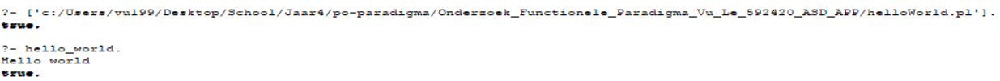

# po-paradigma

## Introduction

This repository contains all the code and needed images for my research about a functional programming language. This assignment is about learning a new language that interests me and differs from the language that we normally learn at school called Java (which is a object-oriënted programming language).

The goal of doing this assignment is to learn the new programming language and spread my gained knowledge about it to fellow students. So the new programming language that I am about to learn is Prolog. Prolog is a logic (declarative) programming language that is mostly based on predicate-logics (logics based on expressions/sayings). Logic is expressed as relations (also called Facts and Rules, which will be explained later). I chose Prolog because it is one of the most mentioned programming languages in functional programming, so I will be able to learn a lot because there is a lot written and documented online about Prolog. It was also recommended by my teacher (Michel Koolwaaij) last year at the course, where he showed a demostration of a Sudoku-solving application that he build.

For this assignment to be a success, I will do a challenge: implementing the shortest-path algorithm (Dijkstra) and demonstrating the algorithm. So obviously, the challenge will only be a success if I succesfully implement the algorithm. I will also allow me to implement some learning material of the APP-course to add some difficulty to my research. 

A lot of my information will come by this [Youtube-tutorial](https://www.youtube.com/watch?v=SykxWpFwMGs). My plan is to follow this guide and some other sources (that will be mentioned in the literature-list at the bottom of this README) to show what I learned about Prolog and to use that knowledge to implement my chosen challenge.

What I will use for this assignment:

  - Operating system: Windows 10 64-bit
  - SWI-Prolog as my IDE
  
## Hello, world

Code I made for this chapter: (Onderzoek_Functionele_Paradigma_Vu_Le_592420_ASD_APP/helloWorld.pl).

Code as mentioned above:

```
hello_world :-
    write('Hello world').

```
To get the output, you first have to call your Prolog file, which acts as a Knowledge Base.
A Knowledge Base is a collection of facts and rules which describe some collection of relationships that we find interesting.
Facts and rules will be explained later in this README.
So it is like a database where information, in this case facts and rules) are stored. 
So the code as shown above is part of the Knowledge Base of HelloWorld (helloWorld.pl). 
In this case the Knowledge Base is helloWorld.pl. So in the image below, that is the first command called in brackets.
If the Knowledge Base exists (which in this case it did), it will return true.
To use a Prolog program (file), we pose queries in the Prolog terminal, in this case, it is 'hello_world' as written in de Knowledge Base. 



As you can see above, it will return the written string 'Hello world' with the boolean 'true' right after. 

